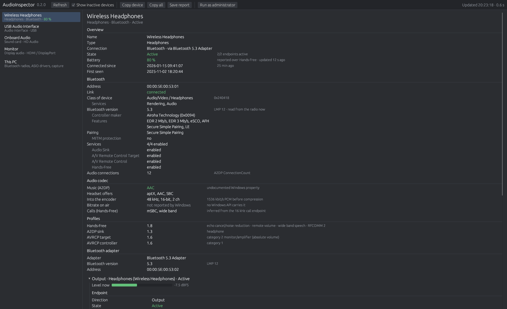

# AudioInspector

**See what Windows doesn't show about your audio devices:** which Bluetooth codec
your headphones are really using, how much battery is left, and the actual
format, sample rates and connection of every speaker, DAC, audio interface and
HDMI output.

One portable exe for Windows 10 and 11. No install, no internet, no admin rights
needed.



## Answers questions like

- Are my headphones playing AAC, aptX or plain SBC?
- How much battery do they have left?
- Why does my headset sound worse on calls? You can see when an app moves to the
  mono Hands-Free profile.
- What format does Windows run my USB DAC at, and which sample rates does it accept?
- Is my audio interface connected at USB 2.0 High Speed? Which ASIO drivers are installed?
- Which apps are playing through this device right now?

## Download

Download the zip from **[Releases](../../releases)**, unzip it and run
`AudioInspector.exe`.

## What it reads

| Connection | What you see |
| --- | --- |
| **Bluetooth** | active codec (SBC, AAC, aptX, aptX Adaptive) and every codec the headset supports · battery · the headset's Bluetooth version · profiles (A2DP, AVRCP, Hands-Free) · call audio quality (narrow or wide band) |
| **USB** | USB version and speed · USB Audio Class version · power draw · formats from the device's descriptors · Type-C port |
| **Onboard and HDMI** | sound chip · jacks and whether something is plugged in · monitor name, audio latency and HDCP over HDMI or DisplayPort |
| **Every device** | shared-mode and mixer format · sample rates and bit depths for exclusive mode · volume · apps playing · spatial sound · audio enhancements · live level meter |
| **ASIO** | installed drivers; on request, channels, buffer sizes, sample rates and latency |

The list shows devices that are active now. Tick *Show inactive devices* to see
disconnected and disabled ones.

## Administrator mode (experimental)

**Run as administrator** adds **Bluetooth capture**: press *Start Bluetooth
capture*, turn your headphones off and on, play some audio, then press *Stop*.
AudioInspector records what Windows' Bluetooth driver reports during that time and
looks for the codec settings the PC and the headphones agree on when they connect,
such as the SBC bitpool or the AAC bitrate limit, which Windows shows nowhere
else. The trace is saved to a log file next to the exe.

It depends on undocumented Windows trace data, so the settings may not appear.

## What Windows doesn't expose

- **Bluetooth bitrate.** Windows agrees on it with the headphones inside its driver
  and reports it nowhere. AudioInspector shows the codec and the audio format going
  into the encoder; administrator mode tries to catch the agreed settings.
- **LDAC and aptX HD.** Windows' built-in Bluetooth audio supports SBC, AAC, aptX
  and, with some Qualcomm adapters, aptX Adaptive. LDAC and aptX HD are not among them.
- **Headphones on an analog cable.** A cable carries no data, so only the jack is visible.

## Safety

| Area | Behaviour |
| --- | --- |
| System changes | None: no writes to settings, the registry, drivers or device configuration |
| Network | None: the program contains no network code |
| Privileges | Standard user. Bluetooth capture needs administrator rights and runs a Windows event trace session (ETW) while it records |
| Device access | Queries only: device properties, Core Audio, USB descriptor requests through the hub driver |
| ASIO query | Loads the selected third-party ASIO driver in a separate helper process with a 15-second limit; no streaming, no sample-rate change |
| Files | Written only by *Save report* and Bluetooth capture, next to the exe. Both contain hardware identifiers such as Bluetooth addresses and serial numbers |

## AI disclosure

AudioInspector was developed with the assistance of an AI coding model, under my
direction and testing. The code has not been independently audited. Keep that in
mind for security reasons.

## Build from source

```
git clone https://github.com/WoxelDoor/AudioInspector
cd AudioInspector
cargo build --release
```

Requires Rust with the MSVC toolchain. The result is `target\release\AudioInspector.exe`,
a single file with the C runtime linked in.

## License

MIT, see [LICENSE](LICENSE). Provided as is, without warranty or support.
Licenses of the bundled libraries and fonts come in the release zip as
`THIRD-PARTY-NOTICES.txt`.

Not affiliated with Microsoft, the Bluetooth SIG, Qualcomm or any device maker.
Product names belong to their owners.
